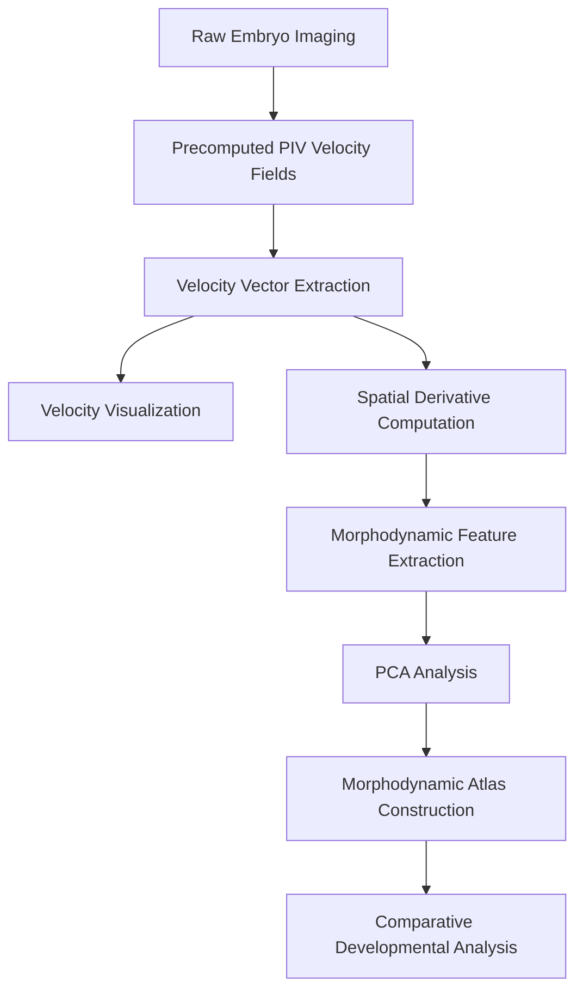
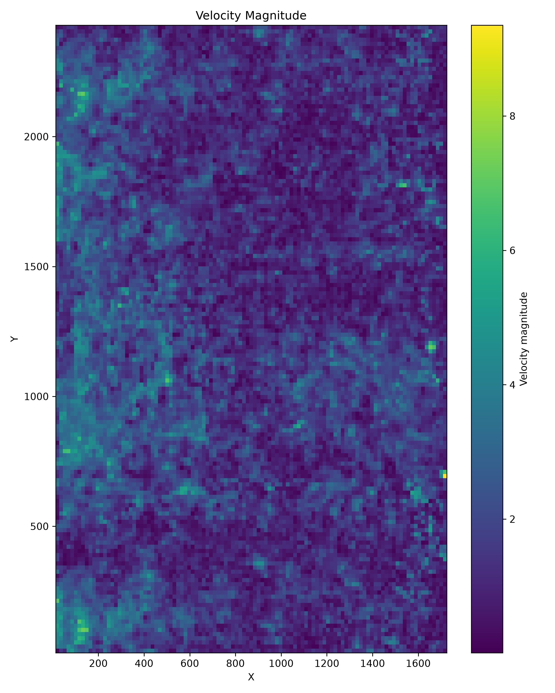

# Embryonic Tissue Velocity Mapping

Quantitative analysis of embryonic tissue dynamics using velocity fields generated by Particle Image Velocimetry (PIV). This repository processes PIVlab-derived flow fields to characterize tissue motion, identify morphodynamic patterns, reconstruct developmental trajectories, and compare developmental phenotypes across genotypes.

---

## Dataset Source

**Dataset:** Morphodynamic Atlas Project

**Description:** Morphodynamic atlas for *Drosophila* development containing precomputed velocity fields, embryo metadata, morphodynamic atlas coordinates, wild-type reference embryos, and multiple genotype-specific embryos.

Source:
https://zenodo.org/records/14285126

---

---
## Installation
Install [anaconda](https://www.anaconda.com/) or [miniconda](https://www.anaconda.com/docs/getting-started/miniconda/main).

Create a conda environment:

```bash
conda create -n qtlm python=3.11
conda activate qtlm
```

Install dependencies:

```bash
pip install -r requirements.txt
```


Please save the dataset folder in `./` as `Data` folder before starting the experiments.

---

### Dataset exploration and velocity field inspection

```bash
python src/velocity_field.py
python src/grid_check.py
python src/inspect_filled_mat.py
python src/debug_one_embryo.py
```
---

### Velocity visualization and motion quantification

```bash
python src/velocity_heatmap.py
python src/mean_speed_vs_time.py
python src/pretty_velocity_map.py
```
---

### Spatial flow analysis

```bash
python src/divergence_maps.py
python src/vorticity_maps.py
python src/debug_derivatives.py
python src/debug_geometry.py
```
---

### Morphodynamic feature extraction and dimensionality reduction

```bash
python src/morphodynamic_pca.py
python src/test_feature_extraction.py
```
---

### Wild-Type atlas construction and developmental trajectory analysis

```bash
python src/multi_embryo_atlas.py
python src/check_wt_format.py
python src/find_real_path.py
```
---

### Multi-genotype comparison and atlas generation

```bash
python src/multigenotype_atlas.py
python src/inspect_genotypes.py
python src/find_wt_files.py
```
---

### Comparative morphodynamic analysis and clustering

```bash
python src/final_morphodynamic_analysis.py
python src/build_inventory.py
```
---

## Results

### Velocity Magnitude Mapping


---

### Velocity Vector Field


---

### Divergence Analysis


---

### Vorticity Analysis


---

### Morphodynamic Principal Component Analysis


---

### Developmental Trajectory Reconstruction


---

### PCA Explained Variance


---

### Wild-Type Morphodynamic Atlas


---

### Multi-Genotype Morphodynamic Atlas


---

### Wild-Type Developmental Trajectory


---

### Genotype Morphodynamic Centroids


---

### Morphodynamic Distance Matrix


---

### Hierarchical Genotype Clustering


---

### Genotype Feature Heatmap


---

### Mean Tissue Speed Across Development


---

### Velocity Magnitude Heatmap



```
