# Results

## Summary

The analysis pipeline transforms PIV-derived velocity fields into quantitative morphodynamic descriptors capable of characterizing embryonic development across multiple spatial and temporal scales. By integrating velocity, divergence, and vorticity measurements with dimensionality reduction and atlas construction approaches, the workflow provides a framework for developmental-state modeling, comparative embryology, and genotype-level phenotypic analysis. This document summarizes the quantitative analysis of embryonic tissue dynamics using Particle Image Velocimetry (PIV)-derived velocity fields.

---

## Velocity Field Reconstruction Reveals Coordinated Tissue Motion

Particle Image Velocimetry was used to reconstruct tissue-scale velocity fields from embryonic imaging data. Spatial velocity maps reveal coordinated directional movements across the embryo and capture large-scale tissue rearrangements occurring during development.

### Velocity Magnitude Map

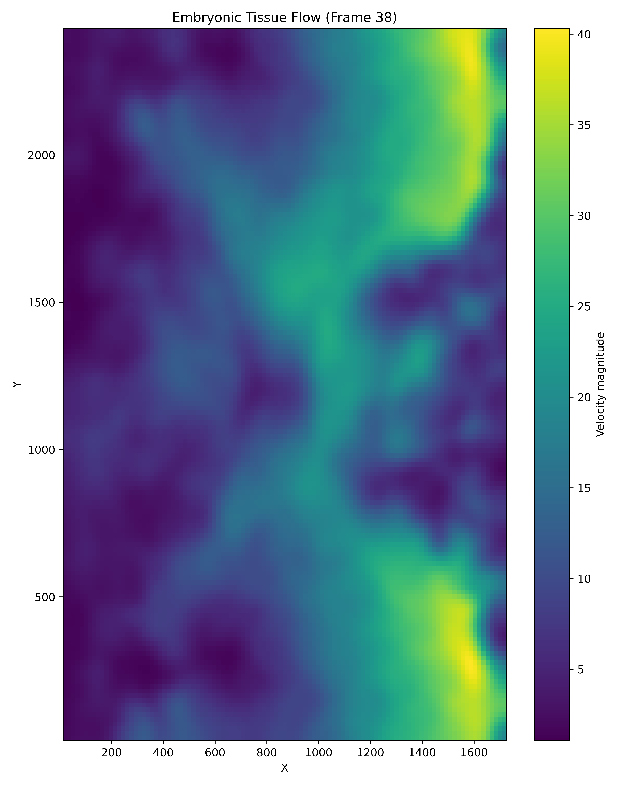

### Velocity Vector Field

Velocity vector fields illustrate the magnitude and direction of tissue motion, highlighting regions of coordinated flow and spatially heterogeneous dynamics.

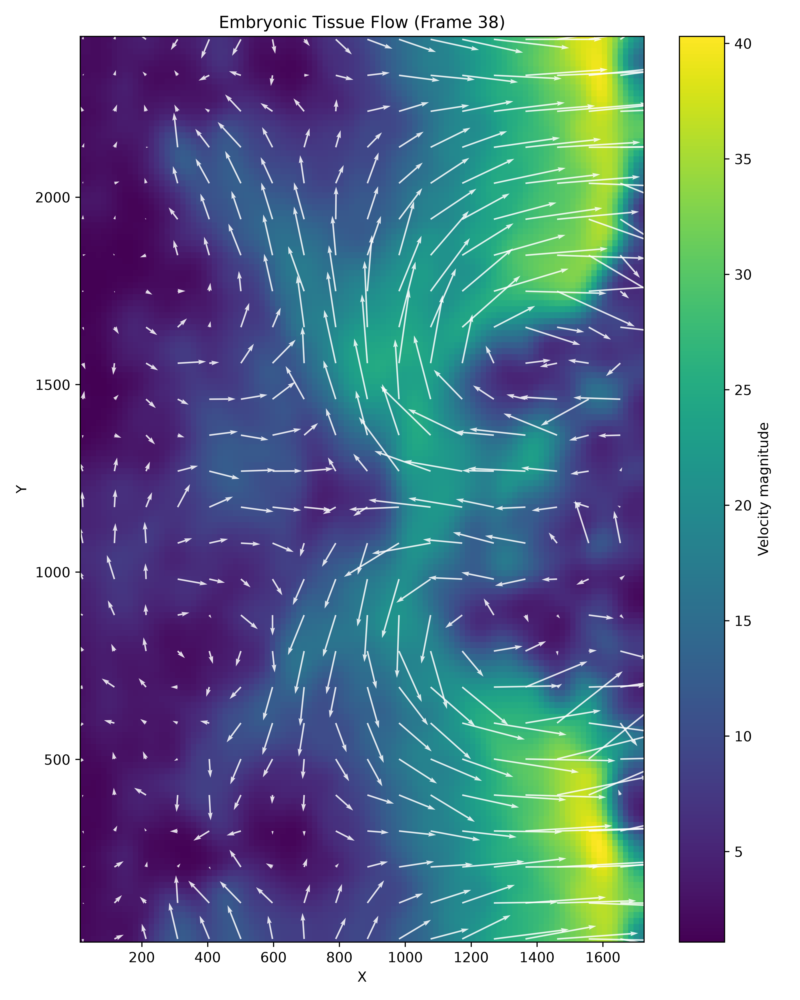

---

## Temporal Changes in Tissue Speed During Development

Mean tissue speed was quantified across the imaging sequence to characterize developmental dynamics. Temporal analysis reveals periods of elevated coordinated motion interspersed with relatively stable developmental intervals.

### Mean Tissue Speed

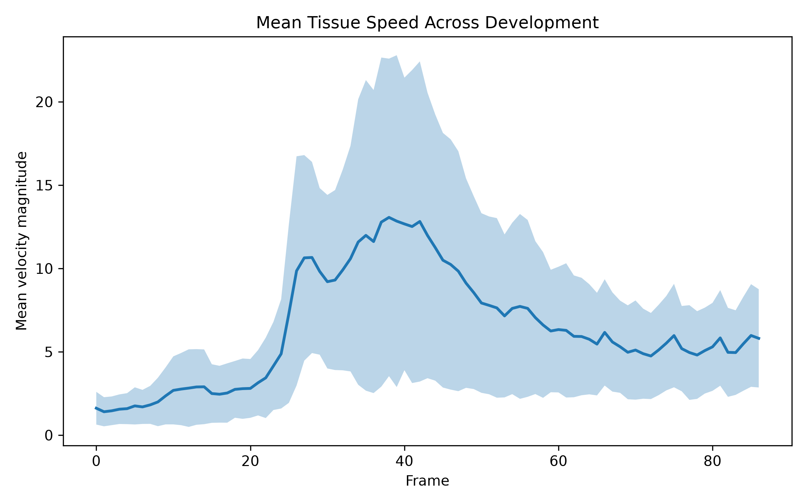

### Developmental Trajectory

Developmental trajectories reconstructed in morphodynamic space reveal transitions between developmental states over time.

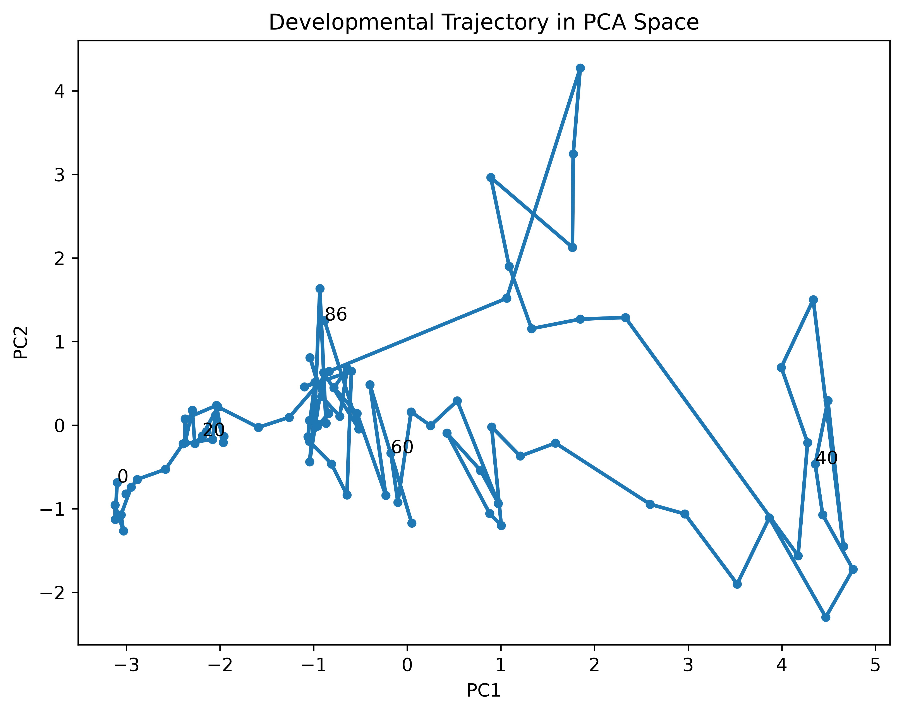

---

## Divergence Analysis Identifies Regions of Tissue Expansion and Contraction

Spatial derivatives of the velocity field were used to estimate tissue divergence. Positive divergence values correspond to local tissue expansion, whereas negative values indicate tissue convergence.

---

## Vorticity Mapping Reveals Rotational Tissue Dynamics

Vorticity analysis quantifies rotational components of tissue motion. Elevated vorticity regions identify localized rotational flows and complex tissue rearrangements.

---

## Morphodynamic Feature Extraction Captures Developmental State

Quantitative descriptors derived from velocity, divergence, and vorticity fields were integrated into a morphodynamic feature space and analyzed using Principal Component Analysis (PCA).

### Morphodynamic PCA

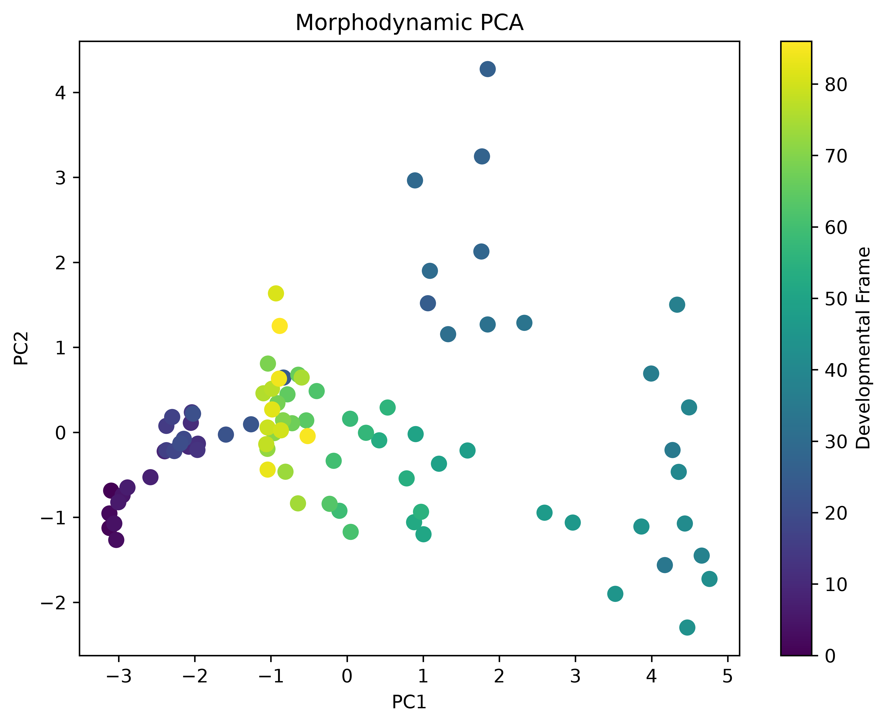

### PCA Explained Variance

The first principal components capture the majority of morphodynamic variation across developmental stages.

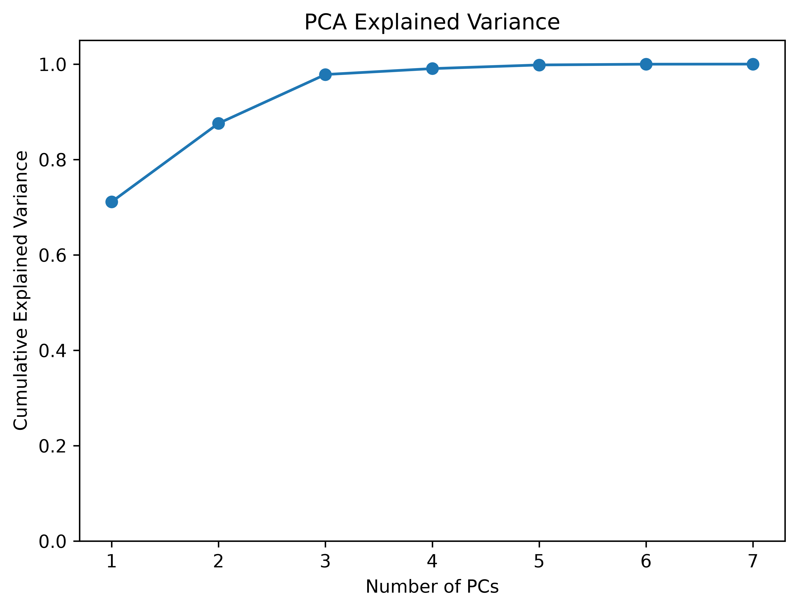

---

## Construction of a Wild-Type Morphodynamic Atlas

Feature extraction across wild-type embryos enabled the generation of a reference morphodynamic atlas describing normal developmental progression.

### Wild-Type Morphodynamic Atlas

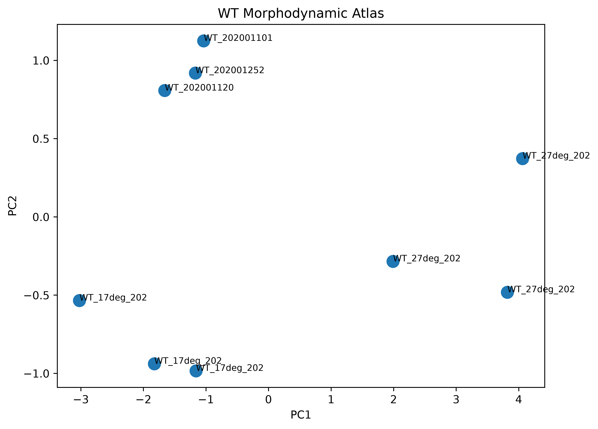

### Wild-Type Developmental Trajectory

Wild-type embryos follow reproducible developmental trajectories through morphodynamic feature space.

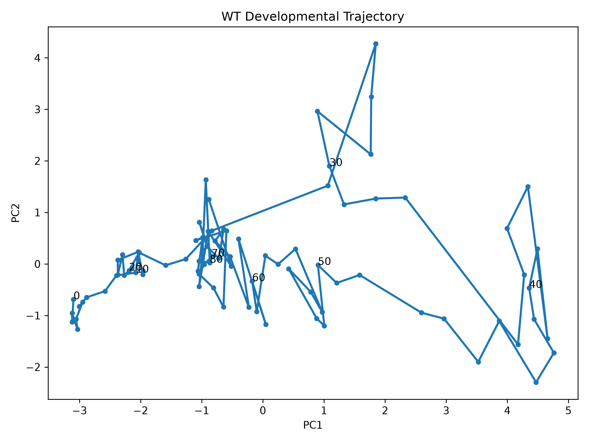

---

## Multi-Embryo Integration Reveals Shared Developmental Trajectories

Integration of multiple embryos within a common morphodynamic framework revealed conserved developmental programs despite biological variability.

---

## Multi-Genotype Atlas Reveals Distinct Dynamic Phenotypes

Extension of the atlas to multiple genotypes revealed genotype-specific developmental trajectories and dynamic phenotypes.

### Multi-Genotype Morphodynamic Atlas

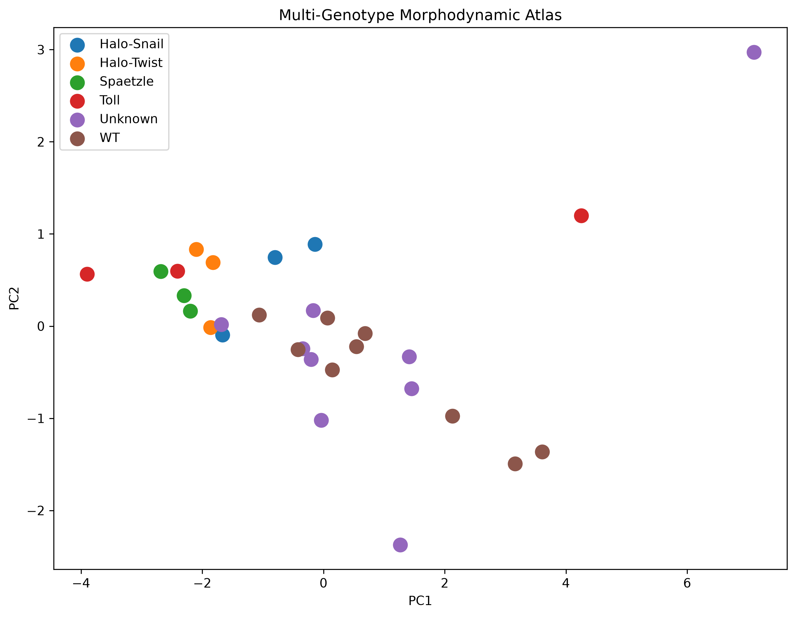

### Genotype Morphodynamic Centroids

Distinct genotype centroids indicate that tissue dynamics can serve as quantitative developmental phenotypes.

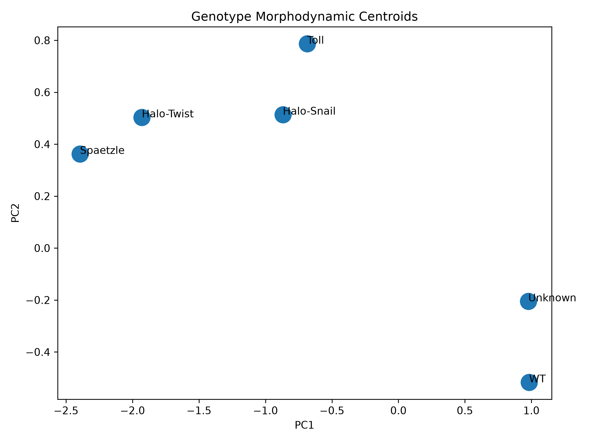

---

## Feature Similarity Analysis Identifies Relationships Between Genotypes

Pairwise comparison of morphodynamic features generated similarity and distance matrices that revealed relationships among developmental conditions.

### Morphodynamic Distance Matrix

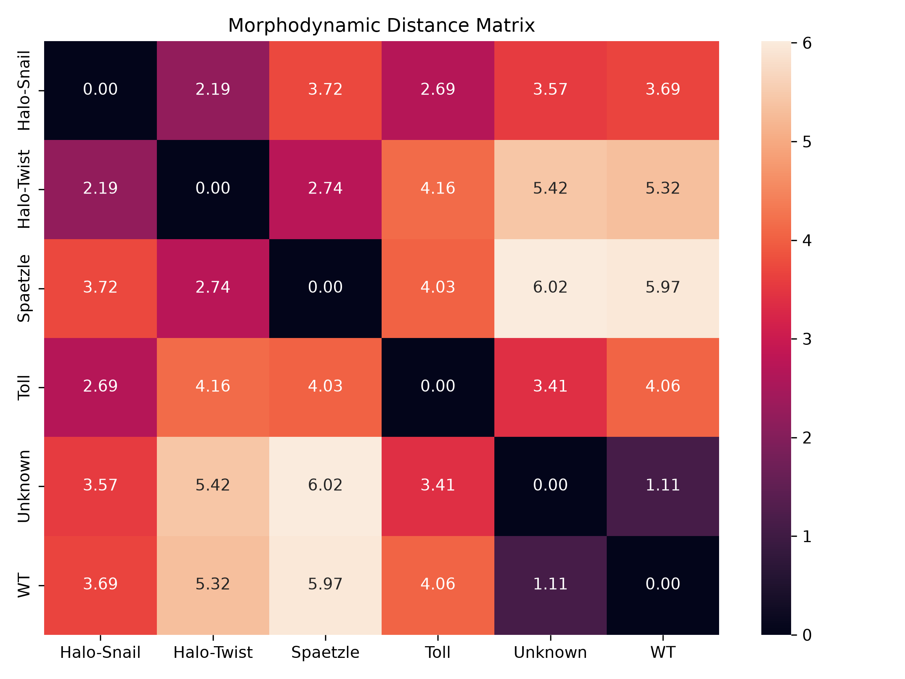

### Hierarchical Genotype Clustering

Clustering analyses identified groups of genotypes sharing related tissue dynamic signatures while separating phenotypically distinct populations.

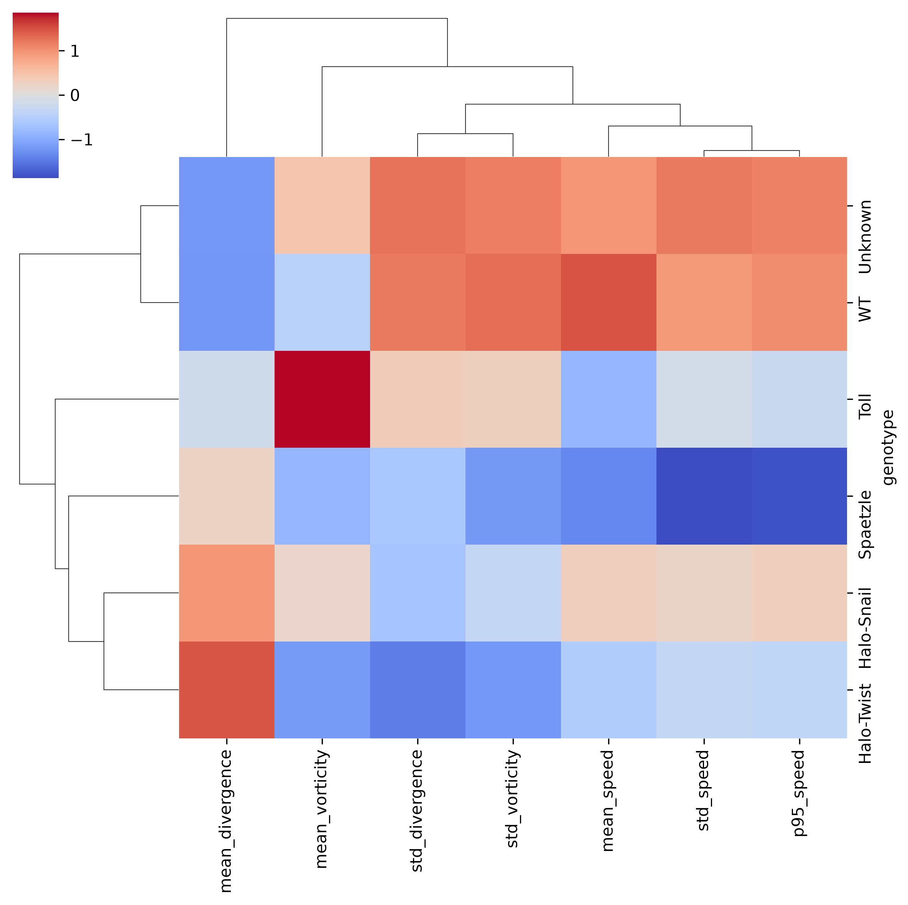

### Genotype Feature Heatmap

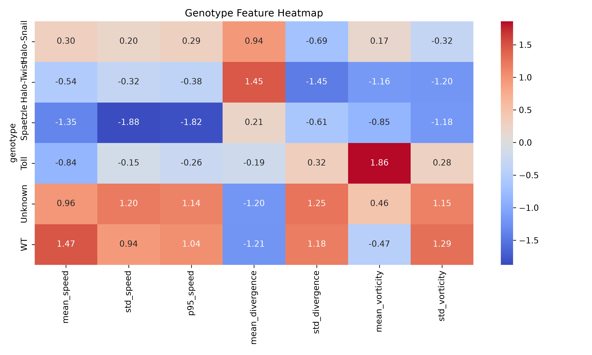

